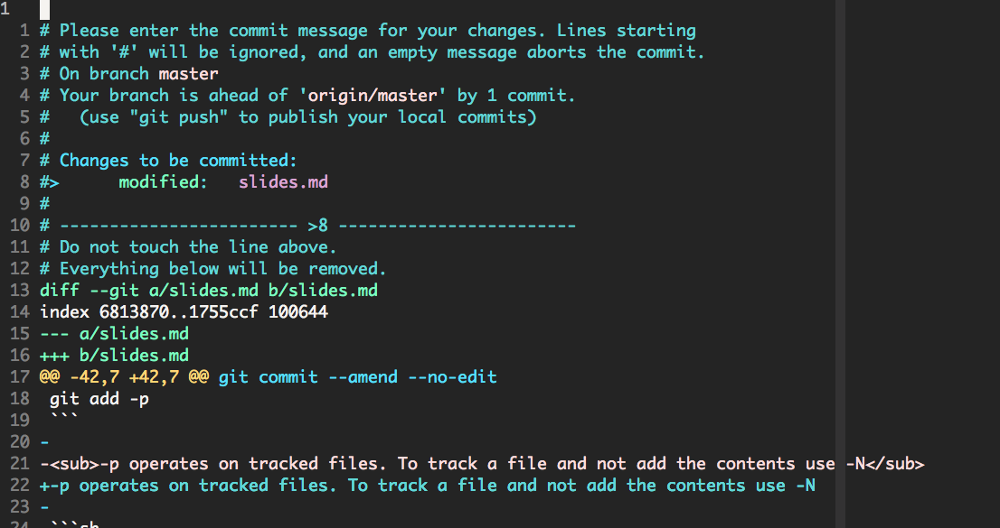
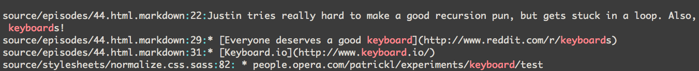
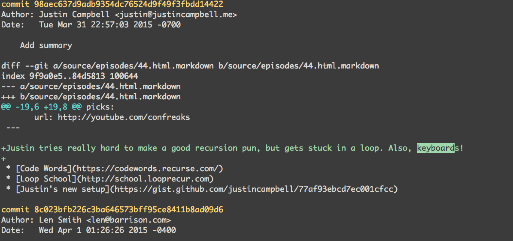
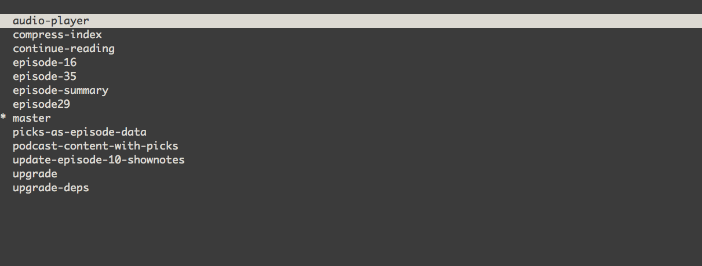
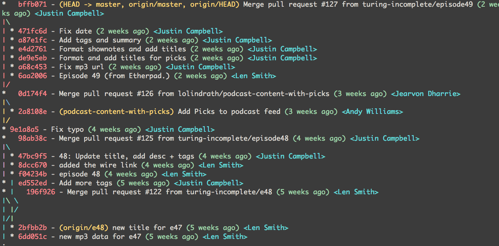

# [fit] Git Productivity

---

## yolo

```sh
alias yolo="git push origin HEAD -f --no-verify"
```

---

## Checkout previous branch

```sh
git checkout -
```

^ - is shorthand for git checkout @{-1}

---

## Show diff while writing commit message

```sh
git commit -v
```



---

## Amend commit with last message

```sh
git commit --amend --no-edit
```

---

## Interactively add changes

```sh
git add -p
```

-p operates on tracked files. To track a file and not add the contents use -N

```sh
git add . -N spec/spec_helper.rb
git add -p spec/spec_helper.rb
```

---

## Remove all untracked files and folders

```sh
git clean -df
```

---

## Diff 2 objects

git diff sha1..sha2
git diff branch1..branch2 <sub>(use 3 dots to diff from the common parent)</sub>

---

## Diff the staging area

```sh
git diff --cached
```

---

## Undo last commit without losing change

```sh
git reset --soft HEAD~1
```

---

## Searching a repo

```sh
git grep keyboard
```



---

## Searching through the log

```sh
git log -p -S keyboard
```



---

## Git autocorrect

```sh
git config --global help.autocorrect 10
```

^ the number is a tenth of a second. 10 => 1 minute

---

## Deleting a branch

### < 1.7.0
```sh
git push origin :branchname
```

### >= 1.7.0
```sh
git push origin --delete branchname
```

---

## Git checkout with pick

* [pick](https://github.com/thoughtbot/pick)

```sh
git checkout $(git branch | pick)
```



^ The pick(1) utility allows users to choose one option from a set of choices using an interface with fuzzy search functionality.

---

## Hub command line utility

[hub](https://github.com/github/hub)

* install hub
* alias git to hub

---

## Examples of hub

```sh
git clone rails/rails
git pull-request
git browse --issues
```

---

## Subway map

```sh
git log --graph \
--pretty=format:'%Cred%h%Creset -%C(yellow)%d%Creset %s %Cgreen(%cr) %C(bold cyan)<%an>%Creset'\
--abbrev-commit --date=relative
```



---

## Jump to git root
```sh
cd `git rev-parse --show-cdup || pwd`
```
